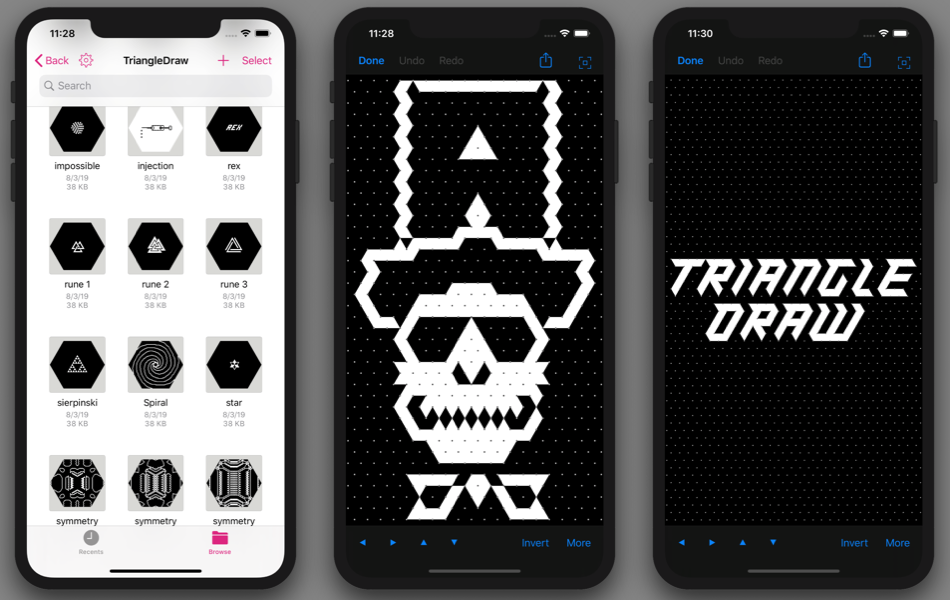

---

# TriangleDraw

TriangleDraw is a versatile sketching app that makes it easy to create logos and designs for branding purposes. Whether you're working on a letterhead or website, this app is a great tool for quickly putting together visually appealing designs.

# Install

TriangleDraw is available for iPad and iPhone. You can download it from the [App Store](https://apps.apple.com/app/id1453533043).

# Inspiration

To see what's possible with TriangleDraw, check out the [TriangleDraw Gallery](https://github.com/triangledraw/TriangleDraw-Gallery). Here you'll find a collection of designs created by users of the app, providing inspiration and ideas for your own creations.

# Community

Want to stay updated on the latest developments and share your own creations? Join the TriangleDraw community on Discord: http://triangledraw.com/discord

# Contact

If you have any questions or feedback, feel free to reach out to the developer, Simon Strandgaard, at [hello@triangledraw.com](mailto:hello@triangledraw.com).
